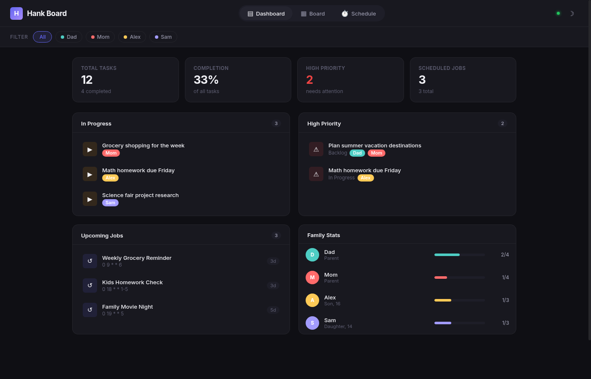

# Hank Board 📋

**A family command center powered by your AI assistant.**

Hank Board isn't just another kanban app — it's the visual dashboard for your [OpenClaw](https://github.com/openclaw/openclaw) AI assistant. Manage your family's tasks, reminders, and schedules through simple **Telegram messages**, and watch them appear in real-time on a beautiful dark-themed dashboard.



## 🤖 AI-Powered Task Management

Forget clunky task apps. Just message your assistant naturally:

```
"Remind me to pick up groceries tomorrow at 5pm"
"Add a task for @alex to finish his science project by Friday !high"
"What's on @mom's plate this week?"
"Move the dentist task to done"
```

Your AI assistant (Hank) handles everything — parsing your intent, assigning family members, setting priorities, and scheduling reminders. The board updates in real-time.

## ✨ Features

### 📱 Telegram-First Workflow
- **Natural language** — No special syntax to memorize
- **Voice messages** — Speak your tasks, Hank transcribes and adds them
- **Instant sync** — Changes appear on the board within seconds
- **Two-way updates** — Edit on the board or via chat, both stay in sync

### 👨‍👩‍👧‍👦 Family-Centric Design
- **@mentions** — Tag family members with `@dad`, `@mom`, `@alex`, etc.
- **Color-coded chips** — Instantly see who's assigned to what
- **Per-person filtering** — Click a family member to see only their tasks
- **Progress tracking** — Family Stats show completion rates per person

### 🔥 Priority System
- **!high** — Red indicators, appears in High Priority section
- **!medium** — Yellow indicators
- **!low** — Green indicators
- Smart sorting puts urgent items front and center

### ⏰ Intelligent Reminders
- **One-shot reminders** — "Remind me in 20 minutes"
- **Recurring schedules** — "Every weekday at 9am"
- **Contextual nudges** — Hank follows up if tasks aren't completed
- **Calendar awareness** — Integrates with your schedule

### 📊 Dashboard Views
| View | Description |
|------|-------------|
| **Dashboard** | At-a-glance stats, high priority items, upcoming jobs, family progress |
| **Board** | Full kanban with Backlog → In Progress → Done columns |
| **Schedule** | All scheduled jobs and reminders with next run times |

### 🔄 Real-Time Everything
- **Server-Sent Events (SSE)** — No refresh needed, ever
- **Multi-device sync** — Open on your phone, tablet, and desktop simultaneously
- **Live task movement** — Drag-and-drop updates instantly across all clients

## 🚀 What We Actually Use It For

This isn't theoretical — here's how our family uses Hank Board daily:

- **Morning standup** — Quick glance at the dashboard over coffee
- **Homework tracking** — Kids' assignments with due dates and priorities  
- **Grocery runs** — Shared list that anyone can add to via Telegram
- **Bill reminders** — Scheduled nudges so nothing slips through
- **Family events** — Coordinating who's doing what for birthdays, holidays
- **Chores rotation** — Fair distribution with visual accountability
- **Project planning** — Summer vacation, home improvement, etc.

## 💬 Example Conversations

**Adding tasks:**
> "Hey Hank, add pick up dry cleaning to my list"  
> ✅ Added "pick up dry cleaning" to Backlog, assigned to @dad

**Setting reminders:**
> "Remind @mom about the parent-teacher conference Thursday at 3pm"  
> ⏰ Reminder set for Thursday 3:00 PM

**Checking status:**
> "What's left in the backlog?"  
> 📋 5 items in Backlog: grocery shopping, oil change, ...

**Completing tasks:**
> "Mark the dentist appointment as done"  
> ✅ Moved "Dentist appointment" to Done

## 🛠️ Installation

```bash
# Clone the repository
git clone https://github.com/HankJediAssistant/hank-board.git
cd hank-board

# Install dependencies
npm install

# Set up your family configuration
cp config/family.example.json config/family.json
# Edit config/family.json with your family members

# Start the server
npm start
```

The board runs at **http://localhost:3456**

### Integration with OpenClaw

Hank Board reads from OpenClaw's workspace files:

| Path | Purpose |
|------|---------|
| `~/.openclaw/workspace/TODO.md` | Task storage (Markdown format) |
| `~/.openclaw/cron/jobs.json` | Scheduled reminders and jobs |

Your OpenClaw assistant writes to these files when you message it, and Hank Board displays them beautifully.

## ⚙️ Configuration

### Family Members

Edit `config/family.json`:

```json
[
  { "id": "dad", "name": "Dad", "role": "Parent", "color": "#4ecdc4" },
  { "id": "mom", "name": "Mom", "role": "Parent", "color": "#ff6b6b" },
  { "id": "alex", "name": "Alex", "role": "Son, 16", "color": "#feca57" },
  { "id": "sam", "name": "Sam", "role": "Daughter, 14", "color": "#a29bfe" }
]
```

The `id` field is used for @mentions in Telegram. Keep it lowercase.

## 🏗️ Tech Stack

- **Backend:** Node.js + Express
- **Frontend:** Vanilla HTML/CSS/JS (no build step!)
- **Storage:** Flat-file Markdown (`TODO.md`)
- **Real-time:** Server-Sent Events (SSE)
- **AI Integration:** [OpenClaw](https://github.com/openclaw/openclaw) + Telegram

## 🔒 Privacy

- **Local-first** — All data stays on your machine
- **No cloud sync** — Your tasks never leave your network
- **No tracking** — Zero analytics or telemetry
- `config/family.json` is gitignored to protect your family's info

## 📄 License

MIT

---

**Built with ❤️ by Hank** — an AI assistant who actually gets things done.

*Part of the [OpenClaw](https://github.com/openclaw/openclaw) ecosystem*
